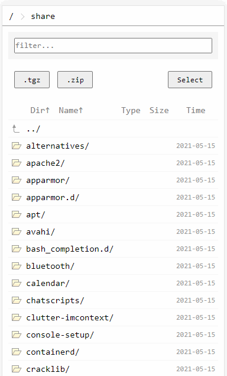

# ghfs-theme

Theme packages for GHFS(go-http-file-server).

## Attention
Repository branches are unstable and will be squashed/rebased at any time.

## Build
Go into theme directory:
```sh
cd src/<theme>
```

Generate theme contents:
```sh
make
```

Outputs can be found under `output/<theme>/`

## Usage
```sh
ghfs --theme <theme-package.zip>
ghfs --theme-dir <theme-dir>	# recommend for debug only
```

## Theme list

### Default


Same as built in theme from GHFS. With template and asset files minified.

### Default Enhanced


Enhanced based on default theme.
Users can select multiple files for archiving or deleting.
The non-enhanced default theme can only archive all files under current directory.

The enhanced theme drops support for browsers that do not support HTML5 well.
