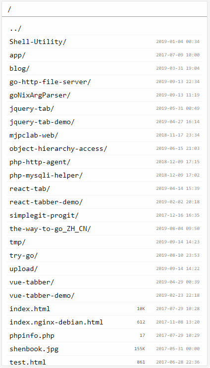

# ghfs-theme

GHFS（go-http-file-server）主题包。

## 注意
版本库分支是不稳定的，且可能在任何时候被squash或rebase。

## 构建
进入主题目录：
```sh
cd src/<theme>
```

生成主题内容：
```sh
make
```

输出内容可以在`output/<theme>/`下找到。

## 用法
```sh
ghfs --theme <主题包.zip>
ghfs --theme-dir <主题目录>	#建议仅用于调试
```

## 主题列表

### Default


与GHFS内建主题相同。已对模板和静态资源压缩（minify）。
